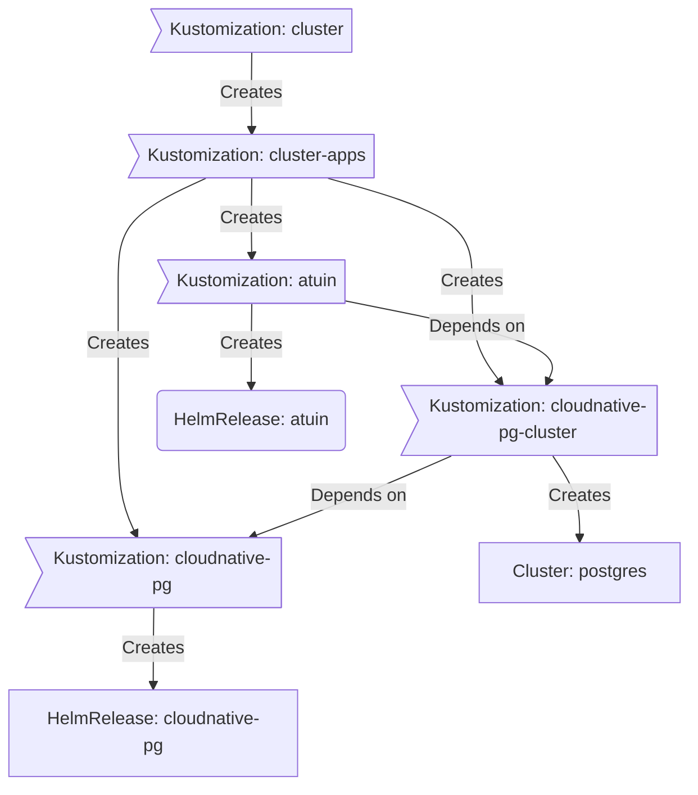

<div align="center">


### My _geeked_ homelab k8s cluster :wheel_of_dharma:

_... automated via [Flux](https://github.com/fluxcd/flux2), [Renovate](https://github.com/renovatebot/renovate) and [GitHub Actions](https://github.com/features/actions)_ :robot:

</div>

<div align="center">

[](https://discord.gg/home-operations)&nbsp;&nbsp;
[](https://talos.dev)&nbsp;&nbsp;
[](https://kubernetes.io)&nbsp;&nbsp;
[](https://github.com/buroa/k8s-gitops/actions/workflows/renovate.yaml)

</div>

<div align="center">

[](https://status.ktwo.io)&nbsp;&nbsp;
[](https://status.ktwo.io)&nbsp;&nbsp;
[](https://status.ktwo.io)

</div>

<div align="center">

[](https://github.com/kashalls/kromgo)&nbsp;&nbsp;
[](https://github.com/kashalls/kromgo)&nbsp;&nbsp;
[](https://github.com/kashalls/kromgo)&nbsp;&nbsp;
[](https://github.com/kashalls/kromgo)&nbsp;&nbsp;
[](https://github.com/kashalls/kromgo)&nbsp;&nbsp;
[](https://github.com/kashalls/kromgo)&nbsp;&nbsp;
[](https://github.com/kashalls/kromgo)

</div>

---

## 📖 Overview

This is a repository for my home infrastructure and Kubernetes cluster. I try to adhere to Infrastructure as Code (IaC) and GitOps practices using tools like [Kubernetes](https://github.com/kubernetes/kubernetes), [Flux](https://github.com/fluxcd/flux2), [Renovate](https://github.com/renovatebot/renovate) and [GitHub Actions](https://github.com/features/actions).

---

## ⛵ Kubernetes

This semi hyper-converged cluster operates on [Talos Linux](https://github.com/siderolabs/talos), an immutable and ephemeral Linux distribution tailored for [Kubernetes](https://github.com/kubernetes/kubernetes), and is deployed on bare-metal [Apple Mac Minis](https://www.apple.com/mac-mini). [Rook](https://github.com/rook/rook) supplies my workloads with persistent block, object, and file storage, while a separate server handles media file storage. The cluster is designed to enable a full teardown without any data loss.

There is a template at [onedr0p/cluster-template](https://github.com/onedr0p/cluster-template) if you want to follow along with some of the practices I use here.

### Core Components

- [actions-runner-controller](https://github.com/actions/actions-runner-controller): Self-hosted Github runners.
- [cert-manager](https://github.com/cert-manager/cert-manager): Creates SSL certificates for services in my cluster.
- [cilium](https://github.com/cilium/cilium): Internal Kubernetes container networking interface.
- [cloudflared](https://github.com/cloudflare/cloudflared): Enables Cloudflare secure access to my ingresses.
- [external-dns](https://github.com/kubernetes-sigs/external-dns): Automatically syncs ingress DNS records to a DNS provider.
- [external-secrets](https://github.com/external-secrets/external-secrets): Managed Kubernetes secrets using [1Password Connect](https://github.com/1Password/connect).
- [ingress-nginx](https://github.com/kubernetes/ingress-nginx): Kubernetes ingress controller using NGINX as a reverse proxy and load balancer.
- [multus](https://github.com/k8snetworkplumbingwg/multus-cni): Multi-homed pod networking.
- [rook](https://github.com/rook/rook): Distributed block storage for peristent storage.
- [sops](https://github.com/getsops/sops): Managed secrets for Kubernetes which are commited to Git.
- [spegel](https://github.com/spegel-org/spegel): Stateless cluster local OCI registry mirror.
- [tailscale](https://github.com/tailscale/tailscale): Private WireGuard based VPN.
- [volsync](https://github.com/backube/volsync): Backup and recovery of persistent volume claims.

### GitOps

[Flux](https://github.com/fluxcd/flux2) monitors my [kubernetes](./kubernetes) folder (see Directories below) and implements changes to my cluster based on the YAML manifests.

Flux operates by recursively searching the [kubernetes/apps](./kubernetes/apps) folder until it locates the top-level `kustomization.yaml` in each directory. It then applies all the resources listed in it. This `kustomization.yaml` typically contains a namespace resource and one or more Flux kustomizations. These Flux kustomizations usually include a `HelmRelease` or other application-related resources, which are then applied.

[Renovate](https://github.com/renovatebot/renovate) monitors my **entire** repository for dependency updates, automatically creating a PR when updates are found. When some PRs are merged, [Flux](https://github.com/fluxcd/flux2) applies the changes to my cluster.

### Directories

This Git repository contains the following directories under [kubernetes](./kubernetes).

```sh
📁 kubernetes      # Kubernetes cluster defined as code
├─📁 apps          # Apps deployed into my cluster grouped by namespace (see below)
├─📁 bootstrap     # Flux installation
└─📁 flux          # Main Flux configuration of repository
```

### Cluster layout

This is a high-level look how Flux deploys my applications with dependencies. Below there are 3 Flux kustomizations `cloudnative-pg`, `cloudnative-pg-cluster`, and `atuin`. `cloudnative-pg` is the first app that needs to be running and healthy before `cloudnative-pg-cluster` and once `cloudnative-pg-cluster` is healthy `atuin` will be deployed.



### Networking

<details>
  <summary>Click to see a high-level network diagram</summary>

  
</details>

---

## 🌐 DNS

I have two instances of `external-dns` running in my cluster. The private DNS instance synchronizes DNS records with a `UDM Pro Max`, while the public DNS instance does the same with `Cloudflare`. This setup is managed by creating ingresses with specific ingress classes: `internal` for the private DNS and `external` for the public DNS. Both ingresses use the `external-dns.alpha.kubernetes.io/target` annotation to specify the target. The `external-dns` instances then syncs the DNS records to their respective platforms accordingly.

---

## 🔧 Hardware

<details>
  <summary>Click to see my rack</summary>

  
</details>

| Device                                          | Count | OS Disk Size | Data Disk Size | Ram  | Operating System | Purpose            |
|-------------------------------------------------|-------|--------------|----------------|------|------------------|--------------------|
| [Apple Mac Mini](## "Intel i7 3.2GHz w/ 10GbE") | 3     | 1TB NVMe     | -              | 64GB | Talos            | Kubernetes Workers |
| [Apple Mac Mini](## "Intel i7 3.2GHz w/ 1GbE")  | 3     | 512GB NVMe   | -              | 32GB | Talos            | Kubernetes Masters |
| APC SMT15000RM2UNC                              | 1     | -            | -              | -    | -                | UPS                |
| Sabrent NVMe M.2 Thunderbolt 3 Enclosure        | 6     | -            | 2TB NVMe       | -    | -                | Rook Ceph          |
| Sonnet 10GbE Thunderbolt 3 Adapter              | 3     | -            | -              | -    | -                | 10GbE              |
| Synology NAS RS1221+                            | 1     | -            | 8x22TB HDD     | 32GB | -                | NFS                |
| UDM Pro Max                                     | 1     | -            | 2x16TB HDD     | -    | UniFi OS         | Router & NVR       |
| USP PDU Pro                                     | 1     | -            | -              | -    | UniFi OS         | PDU                |
| USW Aggregation                                 | 1     | -            | -              | -    | UniFi OS         | Core Switch        |
| USW Enterprise XG 24                            | 1     | -            | -              | -    | UniFi OS         | 10GbE Switch       |
| USW Pro Max 24 PoE                              | 1     | -            | -              | -    | UniFi OS         | 2.5GbE PoE Switch  |

---

## ⭐ Stargazers

<div align="center">

<a href="https://star-history.com/#buroa/k8s-gitops&Date">
  <picture>
    <source media="(prefers-color-scheme: dark)" srcset="https://api.star-history.com/svg?repos=buroa/k8s-gitops&type=Date&theme=dark" />
    <source media="(prefers-color-scheme: light)" srcset="https://api.star-history.com/svg?repos=buroa/k8s-gitops&type=Date" />
    
  </picture>
</a>

</div>

---

## 🤝 Gratitude and Thanks

Many thanks to my friend [@onedrop](https://github.com/onedr0p) and all the fantastic people who donate their time to the [Home Operations](https://discord.gg/home-operations) Discord community. Be sure to check out [kubesearch.dev](https://kubesearch.dev) for ideas on how to deploy applications or get ideas on what you may deploy.

---

## 📜 Changelog

See the latest [release](https://github.com/buroa/k8s-gitops/releases/latest) notes.

---

## 🔏 License

See [LICENSE](./LICENSE).
