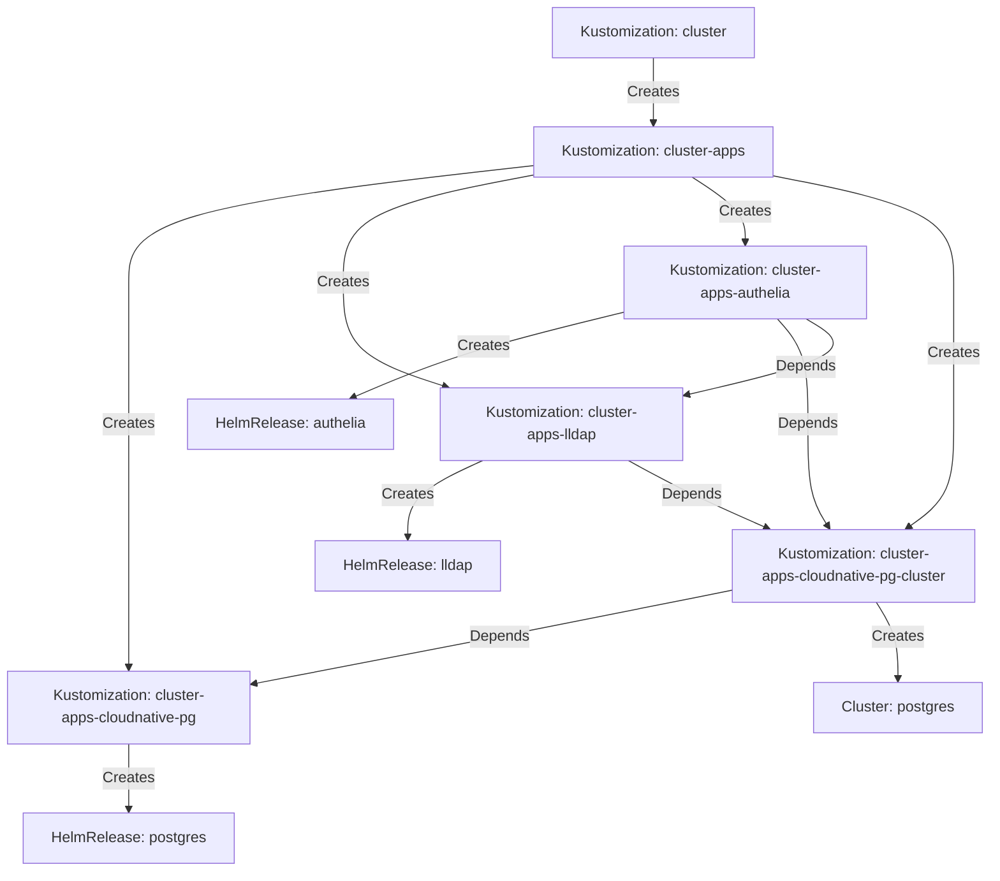

<div align="center">


### My _geeked_ homelab k8s cluster :wheel_of_dharma:

_... automated via [Flux](https://github.com/fluxcd/flux2), [Renovate](https://github.com/renovatebot/renovate) and [GitHub Actions](https://github.com/features/actions)_ :robot:

</div>

<div align="center">

[](https://discord.gg/home-operations)&nbsp;&nbsp;
[](https://kubernetes.io)&nbsp;&nbsp;
[](https://talos.dev)

</div>

<div align="center">

[](https://status.ktwo.io)&nbsp;&nbsp;
[](https://status.ktwo.io/endpoints/_gatus)&nbsp;&nbsp;
[](https://status.ktwo.io/endpoints/_plex)

</div>

<div align="center">

[](https://github.com/kashalls/kromgo)&nbsp;&nbsp;
[](https://github.com/kashalls/kromgo)&nbsp;&nbsp;
[](https://github.com/kashalls/kromgo)&nbsp;&nbsp;
[](https://github.com/kashalls/kromgo)&nbsp;&nbsp;
[](https://github.com/kashalls/kromgo)&nbsp;&nbsp;
[](https://github.com/kashalls/kromgo)&nbsp;&nbsp;
[](https://github.com/kashalls/kromgo)

</div>

---

## 📖 Overview

This is a repository for my home infrastructure and Kubernetes cluster. I try to adhere to Infrastructure as Code (IaC) and GitOps practices using tools like [Kubernetes](https://github.com/kubernetes/kubernetes), [Flux](https://github.com/fluxcd/flux2), [Renovate](https://github.com/renovatebot/renovate) and [GitHub Actions](https://github.com/features/actions).

---

## ⛵ Kubernetes

There is a template over at [onedr0p/cluster-template](https://github.com/onedr0p/cluster-template) if you wanted to try and follow along with some of the practices I use here.

### Installation

This semi hyper-converged cluster runs [Talos Linux](https://github.com/siderolabs/talos), an immutable and ephemeral Linux distribution built for [Kubernetes](https://github.com/kubernetes/kubernetes), deployed on bare-metal [Apple Mac Minis](https://github.com/buroa/talos-boot-assets). [Rook](https://github.com/rook/rook) then provides my workloads with persistent block, object, and file storage; while a seperate server provides file storage for my media.

🔸 _[Click here](./talos/talconfig.yaml) to see my Talos configuration._

### Core Components

- [actions-runner-controller](https://github.com/actions/actions-runner-controller): Self-hosted Github runners.
- [cert-manager](https://github.com/cert-manager/cert-manager): Creates SSL certificates for services in my cluster.
- [cilium](https://github.com/cilium/cilium): Internal Kubernetes container networking interface.
- [cloudflared](https://github.com/cloudflare/cloudflared): Enables Cloudflare secure access to my ingresses.
- [external-dns](https://github.com/kubernetes-sigs/external-dns): Automatically syncs ingress DNS records to a DNS provider.
- [external-secrets](https://github.com/external-secrets/external-secrets): Managed Kubernetes secrets using [1Password Connect](https://github.com/1Password/connect).
- [ingress-nginx](https://github.com/kubernetes/ingress-nginx): Kubernetes ingress controller using NGINX as a reverse proxy and load balancer.
- [multus](https://github.com/k8snetworkplumbingwg/multus-cni): Multi-homed pod networking.
- [rook](https://github.com/rook/rook): Distributed block storage for peristent storage.
- [sops](https://github.com/getsops/sops): Managed secrets for Kubernetes which are commited to Git.
- [spegel](https://github.com/XenitAB/spegel): Stateless cluster local OCI registry mirror.
- [tailscale](https://github.com/tailscale/tailscale): Private WireGuard based VPN.
- [volsync](https://github.com/backube/volsync): Backup and recovery of persistent volume claims.

### GitOps

[Flux](https://github.com/fluxcd/flux2) watches my [kubernetes](./kubernetes) folder (see Directories below) and makes the changes to my cluster based on the YAML manifests.

The way Flux works for me here is it will recursively search the [kubernetes/apps](./kubernetes/apps) folder until it finds the most top level `kustomization.yaml` per directory and then apply all the resources listed in it. That aforementioned `kustomization.yaml` will generally only have a namespace resource and one or many Flux kustomizations. Those Flux kustomizations will generally have a `HelmRelease` or other resources related to the application underneath it which will be applied.

[Renovate](https://github.com/renovatebot/renovate) watches my **entire** repository looking for dependency updates, when they are found a PR is automatically created. When some PRs are merged [Flux](https://github.com/fluxcd/flux2) applies the changes to my cluster.

### Directories

This Git repository contains the following directories under [kubernetes](./kubernetes).

```sh
📁 kubernetes      # Kubernetes cluster defined as code
├─📁 bootstrap     # Flux installation
├─📁 flux          # Main Flux configuration of repository
└─📁 apps          # Apps deployed into my cluster grouped by namespace (see below)
```

### Cluster layout

Below is a a high level look at the layout of how my directory structure with Flux works. In this brief example you are able to see that `authelia` will not be able to run until `lldap` and `cloudnative-pg` are running. It also shows that the `Cluster` custom resource depends on the `cloudnative-pg` Helm chart. This is needed because `cloudnative-pg` installs the `Cluster` custom resource definition in the Helm chart.



### Networking

<details>
  <summary>Click to see a high-level network diagram</summary>

  
</details>

---

## 🌐 DNS

### Home DNS

The UDM Pro resolves DNS queries via [blocky](https://github.com/0xERR0R/blocky), which provides first-hop DNS resolution for my network. Blocky forwards requests targeted towards my public domain via [k8s-gateway](https://github.com/ori-edge/k8s_gateway). Last-hop DNS resolution resolves via [1.1.1.1](https://1.1.1.1/dns), which is configured as my primary DNS upstream provider. If for any reason blocky becomes unavailable, the UDM Pro is configured to fallback to 1.1.1.1 until blocky becomes available again.

🔸 _[Click here](./kubernetes/apps/networking/blocky/app/configs/config.yml) to see my `blocky` configuration or [here](./kubernetes/apps/networking/k8s-gateway/app/configs/Corefile) to see my `k8s-gateway` configuration._

### Public DNS

Outside DNS records are synced to [Cloudflare](https://www.cloudflare.com) using [external-dns](https://github.com/kubernetes-sigs/external-dns). The only DNS records this instance syncs to `Cloudflare` are ones that have an ingress class name of `external` and contain an ingress annotation `external-dns.alpha.kubernetes.io/target`.

---

## 🔧 Hardware

<details>
  <summary>Click to see my rack</summary>

  
</details>

| Device                                   | Count | OS Disk Size | Data Disk Size      | Ram  | Operating System | Purpose             |
|------------------------------------------|-------|--------------|---------------------|------|------------------|---------------------|
| Apple Mac Mini (3.2GHz Intel i7 + 10GbE) | 3     | 1TB NVMe     | -                   | 64GB | Talos            | Kubernetes Workers  |
| Apple Mac Mini (3.2GHz Intel i7)         | 3     | 512GB NVMe   | -                   | 32GB | Talos            | Kubernetes Masters  |
| CyberPower ATS PDU                       | 1     | -            | -                   | -    | -                | PDU                 |
| CyberPower UPS                           | 1     | -            | -                   | -    | -                | PSU                 |
| Sabrent NVMe M.2 Thunderbolt 3 Enclosure | 6     | -            | 2TB NVMe ea.        | -    | -                | Rook Ceph / Workers |
| Sonnet 10GbE Thunderbolt 3 Adapter       | 3     | -            | -                   | -    | -                | 10GbE / Masters     |
| Synology NAS RS1221+                     | 1     | -            | 8x22TB + 2x2TB NVMe | 32GB | -                | NFS                 |
| Ubiquiti UDM Pro                         | 1     | -            | -                   | -    | -                | Router              |
| Ubiquiti USW Enterprise XG 24            | 1     | -            | -                   | -    | -                | 10GbE Switch        |

---

## ⭐ Stargazers

<div align="center">

<a href="https://star-history.com/#buroa/k8s-gitops&Date">
  <picture>
    <source media="(prefers-color-scheme: dark)" srcset="https://api.star-history.com/svg?repos=buroa/k8s-gitops&type=Date&theme=dark" />
    <source media="(prefers-color-scheme: light)" srcset="https://api.star-history.com/svg?repos=buroa/k8s-gitops&type=Date" />
    
  </picture>
</a>

</div>

---

## 🤝 Gratitude and Thanks

 Many thanks to my friend [@onedrop](https://github.com/onedr0p) and all the fantastic people who donate their time to the [Home Operations](https://discord.gg/home-operations) Discord community. Be sure to check out [kubesearch.dev](https://kubesearch.dev) for ideas on how to deploy applications or get ideas on what you may deploy.

---

## 📜 Changelog

See the latest [release](https://github.com/buroa/k8s-gitops/releases/latest) notes.

---

## 🔏 License

See [LICENSE](./LICENSE).
