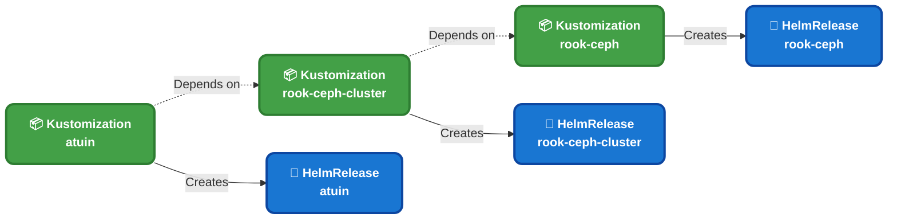

<div align="center">


### A _slightly overengineered_ homelab 

_... managed with [Flux](https://github.com/fluxcd/flux2), [Renovate](https://github.com/renovatebot/renovate), and [GitHub Actions](https://github.com/features/actions)_ 

</div>

<div align="center">

[](https://discord.gg/home-operations)&nbsp;&nbsp;
[](https://talos.dev)&nbsp;&nbsp;
[](https://kubernetes.io)&nbsp;&nbsp;
[](https://fluxcd.io)&nbsp;&nbsp;
[](https://github.com/buroa/k8s-gitops/actions/workflows/renovate.yaml)

</div>

<div align="center">

[](https://status.k13.dev)&nbsp;&nbsp;
[](https://status.k13.dev)&nbsp;&nbsp;
[](https://status.k13.dev)

</div>

<div align="center">

[](https://github.com/home-operations/kromgo)&nbsp;&nbsp;
[](https://github.com/home-operations/kromgo)&nbsp;&nbsp;
[](https://github.com/home-operations/kromgo)&nbsp;&nbsp;
[](https://github.com/home-operations/kromgo)&nbsp;&nbsp;
[](https://github.com/home-operations/kromgo)&nbsp;&nbsp;
[](https://github.com/home-operations/kromgo)&nbsp;&nbsp;
[](https://github.com/home-operations/kromgo)&nbsp;&nbsp;
[](https://github.com/home-operations/kromgo)

</div>

---

##  Overview

This repository is the single source of truth for my home Kubernetes cluster and the workloads that run on it. Every cluster resource — from the operating system layer down to individual application Helm releases — is declared as code and reconciled automatically.

The stack is intentionally boring and reproducible:

- [Talos Linux](https://github.com/siderolabs/talos) — Immutable, API-driven OS that runs nothing but Kubernetes.
- [Flux](https://github.com/fluxcd/flux2) — Continuous reconciliation of cluster state against this repository.
- [Renovate](https://github.com/renovatebot/renovate) — Automated dependency updates across the entire cluster.
- [GitHub Actions](https://github.com/features/actions) — Validation and automation on every commit.

Disaster recovery is built in. Wipe every disk in the rack. Minutes later, the cluster is back — applications running, persistent data intact, zero manual steps. It picks up exactly where it left off.

Want to build something similar? Start with [onedr0p/cluster-template](https://github.com/onedr0p/cluster-template).

---

##  Repository Layout

```sh
📁 bootstrap     # One-time cluster bootstrap (helmfile + kustomize)
📁 kubernetes    # Everything Flux reconciles
├─📁 apps        # Workloads, grouped by namespace
├─📁 components  # Reusable Kustomize components (alerts, volsync, etc.)
└─📁 flux        # Flux system configuration and source repositories
📁 talos         # Talos machine configs and per-node overrides
```

---

##  Cluster

A semi hyper-converged, three-node Kubernetes cluster running on bare-metal [MS-A2](https://store.minisforum.com/products/minisforum-ms-a2) workstations. Persistent storage lives inside the cluster via [Rook Ceph](https://github.com/rook/rook), with bulk media offloaded to a dedicated TrueNAS box over NFS.

### Core components

- [actions-runner-controller](https://github.com/actions/actions-runner-controller) — Self-hosted GitHub runners for CI/CD workflows.
- [cert-manager](https://github.com/cert-manager/cert-manager) — Automated SSL certificate management and provisioning.
- [cilium](https://github.com/cilium/cilium) — High-performance container networking powered by [eBPF](https://ebpf.io).
- [cloudflared](https://github.com/cloudflare/cloudflared) — Secure tunnel providing Cloudflare-protected access to cluster services.
- [envoy-gateway](https://github.com/envoyproxy/gateway) — Modern ingress controller for cluster traffic management.
- [external-dns](https://github.com/kubernetes-sigs/external-dns) — Automated DNS record synchronization for ingress resources.
- [external-secrets](https://github.com/external-secrets/external-secrets) — Kubernetes secrets management integrated with [1Password Connect](https://github.com/1Password/connect).
- [multus](https://github.com/k8snetworkplumbingwg/multus-cni) — Multi-homed pod networking for advanced network configurations.
- [rook](https://github.com/rook/rook) — Cloud-native distributed storage orchestrator for persistent storage.
- [spegel](https://github.com/spegel-org/spegel) — Stateless cluster-local OCI registry mirror for improved performance.
- [volsync](https://github.com/backube/volsync) — Advanced backup and recovery solution for persistent volume claims.

### GitOps workflow

Flux watches the [kubernetes](./kubernetes) directory and reconciles the cluster on every commit. The flow is:

1. Flux recursively scans [kubernetes/apps](./kubernetes/apps) and reads each top-level `kustomization.yaml`.
2. Those entrypoints typically declare a `Namespace` and one or more Flux `Kustomization` resources (`ks.yaml`).
3. Each Flux `Kustomization` materializes a `HelmRelease` (or raw manifests) for an application.
4. Flux applies them in dependency order — e.g. nothing in `rook-ceph` deploys until its prerequisites are healthy.


```mermaid
graph LR
    classDef kustom fill:#43A047,stroke:#2E7D32,stroke-width:3px,color:#fff,font-weight:bold,rx:10,ry:10
    classDef helm fill:#1976D2,stroke:#0D47A1,stroke-width:3px,color:#fff,font-weight:bold,rx:10,ry:10

    A["📦 Kustomization<br/>rook-ceph"]:::kustom
    B["📦 Kustomization<br/>rook-ceph-cluster"]:::kustom
    C["🎯 HelmRelease<br/>rook-ceph"]:::helm
    D["🎯 HelmRelease<br/>rook-ceph-cluster"]:::helm
    E["📦 Kustomization<br/>atuin"]:::kustom
    F["🎯 HelmRelease<br/>atuin"]:::helm

    A -->|Creates| C
    B -->|Creates| D
    B -.->|Depends on| A
    E -->|Creates| F
    E -.->|Depends on| B
```

---

##  Networking

A multi-tier home network built on UniFi hardware. The UDM Beast handles routing and firewalling between RCN's 5Gbps WAN and the LAN. A 25G aggregation switch forms the backbone — bonded to the NAS at 25G LACP and to each Kubernetes node at 10G LACP — while a 24-port PoE+ switch fans out to wired clients and access points.


```mermaid
graph LR
    %% Class Definitions
    classDef wan fill:#f87171,stroke:#fff,stroke-width:2px,color:#fff,font-weight:bold;
    classDef core fill:#60a5fa,stroke:#fff,stroke-width:2px,color:#fff,font-weight:bold;
    classDef agg fill:#34d399,stroke:#fff,stroke-width:2px,color:#fff,font-weight:bold;
    classDef switch fill:#a78bfa,stroke:#fff,stroke-width:2px,color:#fff,font-weight:bold;
    classDef device fill:#facc15,stroke:#fff,stroke-width:2px,color:#000,font-weight:bold;
    classDef vlan fill:#1f2937,stroke:#fff,stroke-width:1px,color:#fff,font-size:12px;

    %% Nodes
    RCN[🛜 RCN<br/>5Gbps WAN]:::wan
    UDM[📦 UDM Beast]:::core
    AGG[🔗 Pro Aggregation XG]:::agg
    NAS[💾 NAS]:::device
    K8s[☸️ Kubernetes<br/>3 Nodes]:::device
    SW[🔌 Pro XG 24 PoE]:::switch
    DEV[💻 Devices]:::device
    WIFI[📶 WiFi Clients]:::device

    %% Subgraph for VLANs
    subgraph VLANs [LAN +vlan]
        direction TB
        LOCAL[LOCAL<br/>192.168.0.0/24]:::vlan
        TRUSTED[TRUSTED*<br/>192.168.1.0/24]:::vlan
        SERVERS[SERVERS*<br/>192.168.10.0/24]:::vlan
        SERVICES[SERVICES*<br/>192.168.20.0/24]:::vlan
        IOT[IOT*<br/>192.168.30.0/24]:::vlan
        GUEST[GUEST*<br/>192.168.40.0/24]:::vlan
    end

    style VLANs fill:#111,stroke:#fff,stroke-width:2px,rx:0,ry:0,padding:20px;

    %% Links
    SERVERS -.-> RCN
    RCN -.->|WAN| UDM
    UDM -- 25G --- AGG
    UDM -- 25G --- SW
    AGG -- 10G LACP --> K8s
    AGG -- 25G LACP --> NAS
    SW --> DEV
    SW --> WIFI

    %% Keep SERVERS->RCN as a hidden layout constraint and style bonded links thicker
    linkStyle 0 stroke:transparent,stroke-width:0px,color:transparent;
    linkStyle 2 stroke-width:4px;
    linkStyle 3 stroke-width:4px;
    linkStyle 4 stroke-width:2px;
    linkStyle 5 stroke-width:4px;
```

### DNS

Two [ExternalDNS](https://github.com/kubernetes-sigs/external-dns) instances handle DNS automation:

- **Private** — Syncs every route to the UDM Beast via the [ExternalDNS UniFi webhook](https://github.com/kashalls/external-dns-unifi-webhook).
- **Public** — Syncs routes on the `external` Gateway to Cloudflare.

The result is split-horizon DNS: at home, public hostnames resolve to LAN IPs, so traffic to my own services never leaves the network.

---

##  Hardware

<details>
  <summary>Click to see my rack</summary>

  
</details>

| Device                       | Count | OS Disk    | Data Disk                  | RAM   | OS            | Purpose              |
| ---------------------------- | ----- | ---------- | -------------------------- | ----- | ------------- | -------------------- |
| Minisforum MS-A2             | 3     | 1.92TB M.2 | 3.84TB U.2 + 1.92TB M.2    | 96GB  | Talos         | Kubernetes           |
| 45HomeLab HL15 2.0           | 1     | 1.92TB M.2 | 12×22TB HDD + 2×7.68TB U.2 | 512GB | TrueNAS SCALE | NFS + Backup Storage |
| JetKVM                       | 3     | -          | -                          | -     | -             | KVM for Kubernetes   |
| UniFi Dream Machine Beast    | 1     | -          | 2×960GB SSD                | -     | UniFi OS      | Router & NVR         |
| UniFi Pro XG Aggregation     | 1     | -          | -                          | -     | UniFi OS      | 25G SFP28 Switch     |
| UniFi Pro XG 24 PoE          | 1     | -          | -                          | -     | UniFi OS      | 10G PoE+ Switch      |
| UniFi Power Distribution Pro | 1     | -          | -                          | -     | UniFi OS      | PDU                  |
| APC SMT1500RM2UNC UPS        | 1     | -          | -                          | -     | -             | UPS                  |

### MS-A2 build

Each MS-A2 (AMD Ryzen™ 9 9955HX) workstation is equipped with:

- [Crucial 96GB Kit (48GBx2) DDR5-5600 SODIMM](https://www.amazon.com/dp/B0C79K5VGZ)
- [Samsung 1.92TB M.2 22x110mm PM9A3 NVMe PCIe 4.0](https://www.amazon.com/dp/B0B23N4P7L)
- [Samsung 3.84TB U.2 PM9A3 NVMe PCIe 4.0](https://www.amazon.com/dp/B0B83W15X6)
- [Google Coral M.2 Accelerator A+E Key](https://www.amazon.com/dp/B0DFMC1GQF)

---

##  Thanks

A huge thank you to [@onedr0p](https://github.com/onedr0p) and the [Home Operations](https://discord.gg/home-operations) Discord community for the knowledge, patterns, and support that made this cluster possible. For more inspiration on running apps in a homelab, browse [kubesearch.dev](https://kubesearch.dev).

---

##  Stargazers

<div align="center">

<a href="https://star-history.com/#buroa/k8s-gitops&Date">
  <picture>
    <source media="(prefers-color-scheme: dark)" srcset="https://api.star-history.com/svg?repos=buroa/k8s-gitops&type=Date&theme=dark" />
    <source media="(prefers-color-scheme: light)" srcset="https://api.star-history.com/svg?repos=buroa/k8s-gitops&type=Date" />
    
  </picture>
</a>

</div>

---

##  License

See [LICENSE](./LICENSE).

---

<div align="center">

[](https://deepwiki.com/buroa/k8s-gitops)

</div>
