<div align="center">


### My _Enterprise™_ Homelab 

_... managed with [Flux](https://github.com/fluxcd/flux2), [Renovate](https://github.com/renovatebot/renovate), and [GitHub Actions](https://github.com/features/actions)_ 

</div>

<div align="center">

[](https://discord.gg/home-operations)&nbsp;
[](https://talos.dev)&nbsp;
[](https://kubernetes.io)&nbsp;
[](https://fluxcd.io)&nbsp;
[](https://github.com/buroa/k8s-gitops/actions/workflows/renovate.yaml)

</div>

<div align="center">

[](https://status.k13.dev)&nbsp;
[](https://status.k13.dev)&nbsp;
[](https://status.k13.dev)

</div>

<div align="center">

[](https://github.com/kashalls/kromgo)&nbsp;
[](https://github.com/kashalls/kromgo)&nbsp;
[](https://github.com/kashalls/kromgo)&nbsp;
[](https://github.com/kashalls/kromgo)&nbsp;
[](https://github.com/kashalls/kromgo)&nbsp;
[](https://github.com/kashalls/kromgo)&nbsp;
[](https://github.com/kashalls/kromgo)

</div>

---

##  Overview

Welcome to my home infrastructure and Kubernetes cluster repository! This project embraces Infrastructure as Code (IaC) and GitOps principles, leveraging [Kubernetes](https://github.com/kubernetes/kubernetes), [Flux](https://github.com/fluxcd/flux2), [Renovate](https://github.com/renovatebot/renovate), and [GitHub Actions](https://github.com/features/actions) to maintain a fully automated, declarative homelab environment.

---

##  Kubernetes

My semi hyper-converged cluster runs [Talos Linux](https://github.com/siderolabs/talos)—an immutable, minimal Linux distribution purpose-built for Kubernetes—on three bare-metal [MS-A2](https://store.minisforum.com/products/minisforum-ms-a2) workstations. Storage is handled by [Rook](https://github.com/rook/rook), providing persistent block, object, and file storage directly within the cluster, complemented by a dedicated NAS for media files. The entire cluster is architected for complete reproducibility: I can tear it down and rebuild from scratch without losing any data.

Want to build something similar? Check out the [onedr0p/cluster-template](https://github.com/onedr0p/cluster-template) to get started with these practices.

### Core Components

- [actions-runner-controller](https://github.com/actions/actions-runner-controller): Self-hosted GitHub runners for CI/CD workflows.
- [cert-manager](https://github.com/cert-manager/cert-manager): Automated SSL certificate management and provisioning.
- [cilium](https://github.com/cilium/cilium): High-performance container networking powered by [eBPF](https://ebpf.io).
- [cloudflared](https://github.com/cloudflare/cloudflared): Secure tunnel providing Cloudflare-protected access to cluster services.
- [envoy-gateway](https://github.com/envoyproxy/gateway): Modern ingress controller for cluster traffic management.
- [external-dns](https://github.com/kubernetes-sigs/external-dns): Automated DNS record synchronization for ingress resources.
- [external-secrets](https://github.com/external-secrets/external-secrets): Kubernetes secrets management integrated with [1Password Connect](https://github.com/1Password/connect).
- [multus](https://github.com/k8snetworkplumbingwg/multus-cni): Multi-homed pod networking for advanced network configurations.
- [rook](https://github.com/rook/rook): Cloud-native distributed storage orchestrator for persistent storage.
- [spegel](https://github.com/spegel-org/spegel): Stateless cluster-local OCI registry mirror for improved performance.
- [volsync](https://github.com/backube/volsync): Advanced backup and recovery solution for persistent volume claims.

### GitOps

[Flux](https://github.com/fluxcd/flux2) continuously monitors the [kubernetes](./kubernetes) folder and reconciles my cluster state with whatever is defined in this Git repository—Git is the single source of truth.

Here's how it works: Flux recursively scans the [kubernetes/apps](./kubernetes/apps) directory, discovering the top-level `kustomization.yaml` in each subdirectory. These files typically define a namespace and one or more Flux `Kustomization` resources (`ks.yaml`). Each Flux `Kustomization` then manages a `HelmRelease` or other Kubernetes resources for that application.

Meanwhile, [Renovate](https://github.com/renovatebot/renovate) continuously scans the **entire** repository for dependency updates, automatically opening pull requests when new versions are available. Once merged, Flux picks up the changes and updates the cluster automatically.

### Directories

This Git repository contains the following directories under [kubernetes](./kubernetes).

```sh
📁 kubernetes      # Kubernetes cluster defined as code
├─📁 apps          # Apps deployed into my cluster grouped by namespace (see below)
├─📁 components    # Re-usable kustomize components
└─📁 flux          # Flux system configuration
```

### Cluster layout

Here's how Flux orchestrates application deployments with dependencies. Most applications are deployed as `HelmRelease` resources that depend on other `HelmRelease`'s, while some `Kustomization`'s depend on other `Kustomization`'s. Occasionally, an application may have dependencies on both types. The diagram below illustrates this: `atuin` won't deploy or upgrade until `rook-ceph-cluster` is successfully installed and healthy.

```mermaid
graph LR
    classDef kustom fill:#43A047,stroke:#2E7D32,stroke-width:3px,color:#fff,font-weight:bold,rx:10,ry:10
    classDef helm fill:#1976D2,stroke:#0D47A1,stroke-width:3px,color:#fff,font-weight:bold,rx:10,ry:10

    A["📦 Kustomization<br/>rook-ceph"]:::kustom
    B["📦 Kustomization<br/>rook-ceph-cluster"]:::kustom
    C["🎯 HelmRelease<br/>rook-ceph"]:::helm
    D["🎯 HelmRelease<br/>rook-ceph-cluster"]:::helm
    E["📦 Kustomization<br/>atuin"]:::kustom
    F["🎯 HelmRelease<br/>atuin"]:::helm

    A -->|Creates| C
    B -->|Creates| D
    B -.->|Depends on| A
    E -->|Creates| F
    E -.->|Depends on| B
```

<details>
  <summary>Click to see a high-level architecture diagram</summary>


</details>

### Networking

My network is built on a multi-tier architecture with enterprise-grade performance. At the core, a UniFi Dream Machine Pro handles routing and firewall duties, connected to a 10/25Gb aggregation switch that provides the backbone. Critical infrastructure—NAS, Kubernetes cluster, and access layer—connects via 10G LACP bonds for redundancy and throughput. A 24-port 2.5G PoE switch serves end devices and wireless access points, all backed by 5Gbps WAN connectivity from RCN.

```mermaid
graph TD
    %% Class Definitions
    classDef wan fill:#f87171,stroke:#fff,stroke-width:2px,color:#fff,font-weight:bold;
    classDef core fill:#60a5fa,stroke:#fff,stroke-width:2px,color:#fff,font-weight:bold;
    classDef agg fill:#34d399,stroke:#fff,stroke-width:2px,color:#fff,font-weight:bold;
    classDef switch fill:#a78bfa,stroke:#fff,stroke-width:2px,color:#fff,font-weight:bold;
    classDef device fill:#facc15,stroke:#fff,stroke-width:2px,color:#000,font-weight:bold;
    classDef vlan fill:#1f2937,stroke:#fff,stroke-width:1px,color:#fff,font-size:12px;

    %% Nodes
    RCN[🛜 RCN<br/>5Gbps WAN]:::wan
    UDM[📦 UDM Pro]:::core
    AGG[🔗 Aggregation<br/>10/25Gb]:::agg
    NAS[💾 NAS<br/>1 Server]:::device
    K8s[☸️ Kubernetes<br/>3 Nodes]:::device
    SW[🔌 24 Port<br/>2.5G PoE]:::switch
    DEV[💻 Devices]:::device
    WIFI[📶 WiFi Clients]:::device

    %% Subgraph for VLANs
    subgraph VLANs [LAN +vlan]
        direction TB
        LOCAL[LOCAL<br/>192.168.0.0/24]:::vlan
        TRUSTED[TRUSTED*<br/>192.168.1.0/24]:::vlan
        SERVERS[SERVERS*<br/>192.168.10.0/24]:::vlan
        SERVICES[SERVICES*<br/>192.168.20.0/24]:::vlan
        IOT[IOT*<br/>192.168.30.0/24]:::vlan
        GUEST[GUEST*<br/>192.168.40.0/24]:::vlan
    end

    style VLANs fill:#111,stroke:#fff,stroke-width:2px,rx:0,ry:0,padding:20px;

    %% Links
    RCN -.->|WAN| UDM
    UDM --> AGG
    AGG -- 10G LACP --- NAS
    AGG -- 10G LACP --- K8s
    AGG -- 10G LACP --- SW
    SW --> DEV
    SW --> WIFI

    %% Style the bonded links thicker
    linkStyle 2 stroke-width:4px,stroke:34d399;
    linkStyle 3 stroke-width:4px,stroke:34d399;
    linkStyle 4 stroke-width:4px,stroke:34d399;

```

<details>
  <summary>Click to see a high-level network diagram</summary>


</details>

---

##  DNS

I run two instances of [ExternalDNS](https://github.com/kubernetes-sigs/external-dns) to handle DNS automation:

- **Private DNS**: Syncs records to my UDM Pro Max via the [ExternalDNS webhook provider for UniFi](https://github.com/kashalls/external-dns-unifi-webhook)
- **Public DNS**: Syncs records to Cloudflare for external services

This is achieved by defining routes with two specific gateways: `internal` for private DNS and `external` for public DNS. Each ExternalDNS instance watches for routes using its assigned gateway and syncs the appropriate DNS records to the corresponding platform.

---

##  Hardware

<details>
  <summary>Click to see my rack</summary>

  
</details>

| Device                        | Count | OS Disk         | Data Disk                   | RAM   | OS               | Purpose                 |
|-------------------------------|-------|-----------------|-----------------------------|----|------------------|-------------------------|
| MS-A2 (AMD Ryzen™ 9 9955HX)   | 3     | 1.92TB M.2      | 3.84TB U.2 + 1.92TB M.2     | 96GB  | Talos            | Kubernetes Nodes        |
| Synology RS1221+              | 1     | -               | 8×22TB HDD                  | 32GB  | DSM 7            | NFS Storage             |
| PiKVM (Raspberry Pi 4)        | 1     | 64GB SD         | -                           | 4GB   | PiKVM            | Remote KVM              |
| TESmart 8-Port KVM            | 1     | -               | -                           | -     | -                | Network KVM             |
| UniFi Dream Machine Pro Max   | 1     | -               | 2×16TB HDD                  | -     | UniFi OS         | Router & NVR            |
| UniFi Switch Pro Aggregation  | 1     | -               | -                           | -     | UniFi OS         | 10G/25Gb Core Switch    |
| UniFi Switch Pro Max 24 PoE   | 1     | -               | -                           | -     | UniFi OS         | 2.5Gb PoE Switch        |
| UniFi SmartPower PDU Pro      | 1     | -               | -                           | -     | UniFi OS         | Managed PDU             |
| APC SMT1500RM2UNC UPS         | 1     | -               | -                           | -     | -                | Backup Power            |

---

### MS-A2 Configuration

Each MS-A2 workstation is equipped with:

- [Crucial 96GB Kit (48GBx2) DDR5-5600 SODIMM](https://www.amazon.com/Crucial-2x48GB-5600MT-5200MT-CT2K48G56C46S5/dp/B0C79K5VGZ)
- [Samsung 1.92TB M.2 22x110mm PM9A3 NVMe PCIe 4.0](https://www.amazon.com/SAMSUNG-1-9TB-PM9A3-NVMe-PCIe/dp/B0B23N4P7L)
- [Samsung 3.84TB U.2 PM9A3 NVMe PCIe 4.0](https://www.amazon.com/Samsung-PM9A3-Solid-State-Drive/dp/B0B83W15X6)
- [Sparkle Intel Arc A310 ECO 4GB GPU](https://www.amazon.com/dp/B0CSFJN835)
- [Google Coral M.2 Accelerator A+E Key](https://coral.ai/products/m2-accelerator-ae)

##  Stargazers

<div align="center">

<a href="https://star-history.com/#buroa/k8s-gitops&Date">
  <picture>
    <source media="(prefers-color-scheme: dark)" srcset="https://api.star-history.com/svg?repos=buroa/k8s-gitops&type=Date&theme=dark" />
    <source media="(prefers-color-scheme: light)" srcset="https://api.star-history.com/svg?repos=buroa/k8s-gitops&type=Date" />
    
  </picture>
</a>

</div>

---

##  Thanks

Huge thanks to [@onedr0p](https://github.com/onedr0p) and the amazing [Home Operations](https://discord.gg/home-operations) Discord community for their knowledge and support. If you're looking for inspiration, check out [kubesearch.dev](https://kubesearch.dev) to discover how others are deploying applications in their homelabs.

---

##  License

See [LICENSE](./LICENSE).
