```mermaid
graph TD
    %% Class Definitions
    classDef wan fill:#f87171,stroke:#fff,stroke-width:2px,color:#fff,font-weight:bold;
    classDef core fill:#60a5fa,stroke:#fff,stroke-width:2px,color:#fff,font-weight:bold;
    classDef agg fill:#34d399,stroke:#fff,stroke-width:2px,color:#fff,font-weight:bold;
    classDef switch fill:#a78bfa,stroke:#fff,stroke-width:2px,color:#fff,font-weight:bold;
    classDef device fill:#facc15,stroke:#fff,stroke-width:2px,color:#000,font-weight:bold;
    classDef vlan fill:#1f2937,stroke:#fff,stroke-width:1px,color:#fff,font-size:12px;

    %% Nodes
    RCN[🛜 RCN<br/>5Gbps WAN]:::wan
    UDM[📦 UDM Pro]:::core
    AGG[🔗 Aggregation<br/>10/25Gb]:::agg
    NAS[💾 NAS<br/>1 Server]:::device
    K8s[☸️ Kubernetes<br/>3 Nodes]:::device
    SW[🔌 24 Port<br/>2.5G PoE]:::switch
    DEV[💻 Devices]:::device
    WIFI[📶 WiFi Clients]:::device

    %% Subgraph for VLANs
    subgraph VLANs [LAN +vlan]
        direction TB
        LOCAL[LOCAL<br/>192.168.0.0/24]:::vlan
        TRUSTED[TRUSTED*<br/>192.168.1.0/24]:::vlan
        SERVERS[SERVERS*<br/>192.168.10.0/24]:::vlan
        SERVICES[SERVICES*<br/>192.168.20.0/24]:::vlan
        IOT[IOT*<br/>192.168.30.0/24]:::vlan
        GUEST[GUEST*<br/>192.168.40.0/24]:::vlan
    end

    style VLANs fill:#111,stroke:#fff,stroke-width:2px,rx:0,ry:0,padding:20px;

    %% Links
    RCN -.->|WAN| UDM
    UDM --> AGG
    AGG -- 10G LACP --- NAS
    AGG -- 10G LACP --- K8s
    AGG -- 10G LACP --- SW
    SW --> DEV
    SW --> WIFI

    %% Style the bonded links thicker
    linkStyle 2 stroke-width:4px,stroke:34d399;
    linkStyle 3 stroke-width:4px,stroke:34d399;
    linkStyle 4 stroke-width:4px,stroke:34d399;

```

<div align="center">


### My _geeked_ homelab k8s cluster 

_... automated via [Flux](https://github.com/fluxcd/flux2), [Renovate](https://github.com/renovatebot/renovate), and [GitHub Actions](https://github.com/features/actions)_ 

</div>

<div align="center">

[](https://discord.gg/home-operations)&nbsp;&nbsp;
[](https://talos.dev)&nbsp;&nbsp;
[](https://kubernetes.io)&nbsp;&nbsp;
[](https://fluxcd.io)&nbsp;&nbsp;
[](https://github.com/buroa/k8s-gitops/actions/workflows/renovate.yaml)

</div>

<div align="center">

[](https://status.k13.dev)&nbsp;&nbsp;
[](https://status.k13.dev)&nbsp;&nbsp;
[](https://status.k13.dev)

</div>

<div align="center">

[](https://github.com/kashalls/kromgo)&nbsp;&nbsp;
[](https://github.com/kashalls/kromgo)&nbsp;&nbsp;
[](https://github.com/kashalls/kromgo)&nbsp;&nbsp;
[](https://github.com/kashalls/kromgo)&nbsp;&nbsp;
[](https://github.com/kashalls/kromgo)&nbsp;&nbsp;
[](https://github.com/kashalls/kromgo)&nbsp;&nbsp;
[](https://github.com/kashalls/kromgo)&nbsp;&nbsp;
[](https://github.com/kashalls/kromgo)

</div>

---

##  Overview

This is a repository for my home infrastructure and Kubernetes cluster. I try to adhere to Infrastructure as Code (IaC) and GitOps practices using tools like [Kubernetes](https://github.com/kubernetes/kubernetes), [Flux](https://github.com/fluxcd/flux2), [Renovate](https://github.com/renovatebot/renovate), and [GitHub Actions](https://github.com/features/actions).

---

##  Kubernetes

This semi hyper-converged cluster operates on [Talos Linux](https://github.com/siderolabs/talos), an immutable and ephemeral Linux distribution tailored for [Kubernetes](https://github.com/kubernetes/kubernetes), and is deployed on bare-metal [MS-A2](https://store.minisforum.com/products/minisforum-ms-a2) workstations. [Rook](https://github.com/rook/rook) supplies my workloads with persistent block, object, and file storage, while a separate server handles media file storage. The cluster is designed to enable a full teardown without any data loss.

There is a template at [onedr0p/cluster-template](https://github.com/onedr0p/cluster-template) if you want to follow along with some of the practices I use here.

### Core Components

- [actions-runner-controller](https://github.com/actions/actions-runner-controller): Self-hosted GitHub runners for CI/CD workflows.
- [cert-manager](https://github.com/cert-manager/cert-manager): Automated SSL certificate management and provisioning.
- [cilium](https://github.com/cilium/cilium): High-performance container networking powered by [eBPF](https://ebpf.io).
- [cloudflared](https://github.com/cloudflare/cloudflared): Secure tunnel providing Cloudflare-protected access to cluster services.
- [envoy-gateway](https://github.com/envoyproxy/gateway): Modern ingress controller for cluster traffic management.
- [external-dns](https://github.com/kubernetes-sigs/external-dns): Automated DNS record synchronization for ingress resources.
- [external-secrets](https://github.com/external-secrets/external-secrets): Kubernetes secrets management integrated with [1Password Connect](https://github.com/1Password/connect).
- [multus](https://github.com/k8snetworkplumbingwg/multus-cni): Multi-homed pod networking for advanced network configurations.
- [rook](https://github.com/rook/rook): Cloud-native distributed storage orchestrator for persistent storage.
- [spegel](https://github.com/spegel-org/spegel): Stateless cluster-local OCI registry mirror for improved performance.
- [volsync](https://github.com/backube/volsync): Advanced backup and recovery solution for persistent volume claims.

### GitOps

[Flux](https://github.com/fluxcd/flux2) watches my [kubernetes](./kubernetes) folder (see Directories below) and makes the changes to my clusters based on the state of my Git repository.

The way Flux works for me here is it will recursively search the [kubernetes/apps](./kubernetes/apps) folder until it finds the most top level `kustomization.yaml` per directory and then apply all the resources listed in it. That aforementioned `kustomization.yaml` will generally only have a namespace resource and one or many Flux kustomizations (`ks.yaml`). Under the control of those Flux kustomizations there will be a `HelmRelease` or other resources related to the application which will be applied.

[Renovate](https://github.com/renovatebot/renovate) monitors my **entire** repository for dependency updates, automatically creating a PR when updates are found. When some PRs are merged Flux applies the changes to my cluster.

### Directories

This Git repository contains the following directories under [kubernetes](./kubernetes).

```sh
📁 kubernetes      # Kubernetes cluster defined as code
├─📁 apps          # Apps deployed into my cluster grouped by namespace (see below)
├─📁 components    # Re-usable kustomize components
└─📁 flux          # Flux system configuration
```

### Cluster layout

This is a high-level look how Flux deploys my applications with dependencies. In most cases a `HelmRelease` will depend on other `HelmRelease`'s, in other cases a `Kustomization` will depend on other `Kustomization`'s, and in rare situations an app can depend on a `HelmRelease` and a `Kustomization`. The example below shows that `atuin` won't be deployed or upgrade until the `rook-ceph-cluster` Helm release is installed or in a healthy state.

```mermaid
graph TD
    A["📦 Kustomization: rook-ceph"]:::kustom -->|Creates| B["🎯 HelmRelease: rook-ceph"]:::helm
    A -->|Creates| C["🎯 HelmRelease: rook-ceph-cluster"]:::helm
    C -->|Depends on| B
    D["📦 Kustomization: atuin"]:::kustom -->|Creates| E["🎯 HelmRelease: atuin"]:::helm
    E -->|Depends on| C

    classDef kustom fill:#4CAF50,stroke:#2E7D32,stroke-width:2px,color:#fff,font-weight:bold;
    classDef helm fill:#2196F3,stroke:#0D47A1,stroke-width:2px,color:#fff,font-weight:bold;

    %% Gradients (Mermaid doesn't support native gradients yet, so we mimic with softer colors)
    classDef kustom fill:#43A047;
    classDef helm fill:#1976D2;
```



### Networking

<details>
  <summary>Click to see a high-level network diagram</summary>


</details>

---

##  DNS

In my cluster there are two instances of [ExternalDNS](https://github.com/kubernetes-sigs/external-dns) running. One for syncing private DNS records to my `UDM Pro Max` using [ExternalDNS webhook provider for UniFi](https://github.com/kashalls/external-dns-unifi-webhook), while another instance syncs public DNS to `Cloudflare`. This setup is managed by creating routes with two specific gatways: `internal` for private DNS and `external` for public DNS. The `external-dns` instances then syncs the DNS records to their respective platforms accordingly.

---

##  Hardware

<details>
  <summary>Click to see my rack</summary>

  
</details>

| Device                        | Count | OS Disk Size   | Data Disk Size             | Ram   | Operating System | Purpose                 |
|-------------------------------|-------|---------------|-----------------------------|-------|------------------|-------------------------|
| MS-A2 (AMD Ryzen™ 9 9955HX)   | 3     | 1.92TB M.2    | 3.84TB U.2 + 1.92TB M.2     | 96GB  | Talos            | Kubernetes              |
| Synology NAS RS1221+          | 1     | -             | 8x22TB HDD                  | 32GB  | DSM 7            | NFS                     |
| PiKVM (RasPi 4)               | 1     | 64GB (SD)     | -                           | 4GB   | PiKVM            | KVM                     |
| TESmart 8 Port KVM Switch     | 1     | -             | -                           | -     | -                | Network KVM (for PiKVM) |
| UniFi UDM Pro Max             | 1     | -             | 2x16TB HDD                  | -     | UniFi OS         | Router & NVR            |
| UniFi USW Pro Aggregation     | 1     | -             | -                           | -     | UniFi OS         | 10G/25Gb Core Switch    |
| UniFi USW Pro Max 24 PoE      | 1     | -             | -                           | -     | UniFi OS         | 2.5Gb PoE Switch        |
| UniFi USP PDU Pro             | 1     | -             | -                           | -     | UniFi OS         | PDU                     |
| APC SMT15000RM2UNC            | 1     | -             | -                           | -     | -                | UPS                     |
---

My MS-A2 workstations are configured with the following hardware:

- [Crucial 96GB Kit (48GBx2) DDR5-5600 SODIMM](https://www.crucial.com/memory/ddr5/ct2k48g56c46s5)
- [Samsung 1.92TB M.2 22x110mm PM9A3 NVMe PCIe 4.0](https://www.cdw.com/product/samsung-pm9a3-mz1l21t9hcls-ssd-1.92-tb-pcie-4.0-x4-nvme/7289154)
- [Samsung 3.84TB U.2 PM9A3 NVMe PCIe 4.0](https://www.cdw.com/product/samsung-pm9a3-pcie-gen-4-nvme-solid-state-drive/6457945)
- [Google Coral M.2 Accelerator A+E Key](https://coral.ai/products/m2-accelerator-ae)

##  Stargazers

<div align="center">

<a href="https://star-history.com/#buroa/k8s-gitops&Date">
  <picture>
    <source media="(prefers-color-scheme: dark)" srcset="https://api.star-history.com/svg?repos=buroa/k8s-gitops&type=Date&theme=dark" />
    <source media="(prefers-color-scheme: light)" srcset="https://api.star-history.com/svg?repos=buroa/k8s-gitops&type=Date" />
    
  </picture>
</a>

</div>

---

##  Gratitude and Thanks

Many thanks to my friend [@onedrop](https://github.com/onedr0p) and all the fantastic people who donate their time to the [Home Operations](https://discord.gg/home-operations) Discord community. Be sure to check out [kubesearch.dev](https://kubesearch.dev) for ideas on how to deploy applications or get ideas on what you may deploy.

---

##  Changelog

See the latest [release](https://github.com/buroa/k8s-gitops/releases/latest) notes.

---

##  License

See [LICENSE](./LICENSE).
